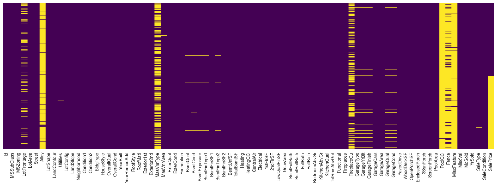
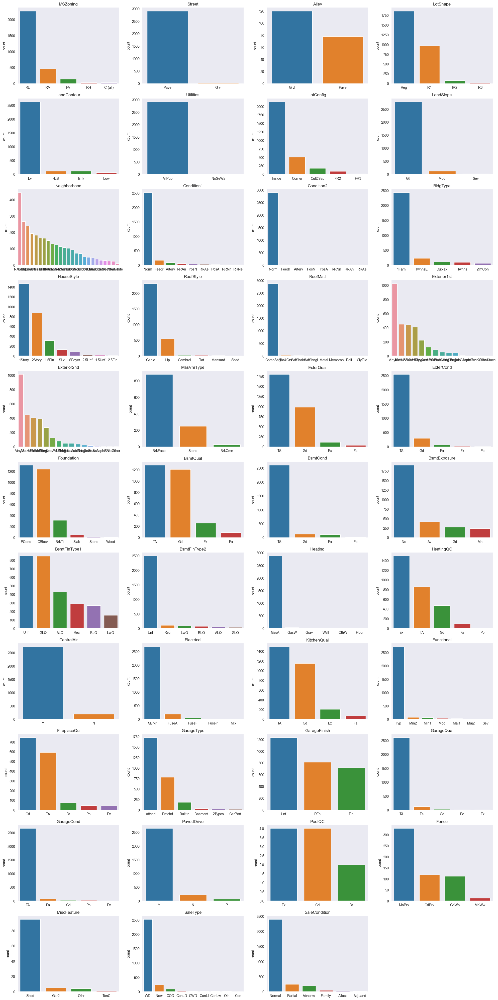
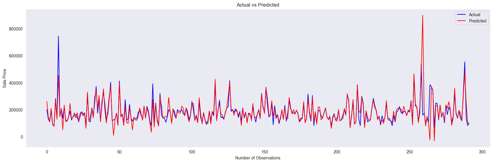
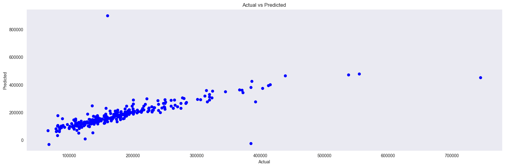

```python
# House Price Prediction using Linear Regression
import pandas as pd
import numpy as np
import matplotlib.pyplot as plt
import seaborn as sns
from sklearn.linear_model import LinearRegression
from sklearn.metrics import mean_squared_error, r2_score
from sklearn.preprocessing import LabelEncoder
from sklearn.preprocessing import StandardScaler
from sklearn.preprocessing import MinMaxScaler
```


```python
# Import the dataset
df_train = pd.read_csv('train.csv')
df_test = pd.read_csv('test.csv')
```


```python
# Check the shape of the dataset
print(df_train.shape)
print(df_test.shape)
```

    (1460, 81)
    (1459, 80)


```python
# Catetorical features
s = (df_train.dtypes == 'object')
object_cols = list(s[s].index)
print("Categorical variables:", object_cols)
print("Number of Categorical variables:", len(object_cols))

# Numerical features
t = (df_train.dtypes == 'int64') | (df_train.dtypes == 'float64')
num_cols = list(t[t].index)
print("Numerical variables:", num_cols)
print("Number of Numerical variables:", len(num_cols))
```

    Categorical variables: ['MSZoning', 'Street', 'Alley', 'LotShape', 'LandContour', 'Utilities', 'LotConfig', 'LandSlope', 'Neighborhood', 'Condition1', 'Condition2', 'BldgType', 'HouseStyle', 'RoofStyle', 'RoofMatl', 'Exterior1st', 'Exterior2nd', 'MasVnrType', 'ExterQual', 'ExterCond', 'Foundation', 'BsmtQual', 'BsmtCond', 'BsmtExposure', 'BsmtFinType1', 'BsmtFinType2', 'Heating', 'HeatingQC', 'CentralAir', 'Electrical', 'KitchenQual', 'Functional', 'FireplaceQu', 'GarageType', 'GarageFinish', 'GarageQual', 'GarageCond', 'PavedDrive', 'PoolQC', 'Fence', 'MiscFeature', 'SaleType', 'SaleCondition']
    Number of Categorical variables: 43
    Numerical variables: ['Id', 'MSSubClass', 'LotFrontage', 'LotArea', 'OverallQual', 'OverallCond', 'YearBuilt', 'YearRemodAdd', 'MasVnrArea', 'BsmtFinSF1', 'BsmtFinSF2', 'BsmtUnfSF', 'TotalBsmtSF', '1stFlrSF', '2ndFlrSF', 'LowQualFinSF', 'GrLivArea', 'BsmtFullBath', 'BsmtHalfBath', 'FullBath', 'HalfBath', 'BedroomAbvGr', 'KitchenAbvGr', 'TotRmsAbvGrd', 'Fireplaces', 'GarageYrBlt', 'GarageCars', 'GarageArea', 'WoodDeckSF', 'OpenPorchSF', 'EnclosedPorch', '3SsnPorch', 'ScreenPorch', 'PoolArea', 'MiscVal', 'MoSold', 'YrSold', 'SalePrice']
    Number of Numerical variables: 38


```python
# data_description.txt
frame_description = open('data_description.txt', 'r')
print(frame_description.read())
frame_description.close()
```

    MSSubClass: Identifies the type of dwelling involved in the sale.	
    
            20	1-STORY 1946 & NEWER ALL STYLES
            30	1-STORY 1945 & OLDER
            40	1-STORY W/FINISHED ATTIC ALL AGES
            45	1-1/2 STORY - UNFINISHED ALL AGES
            50	1-1/2 STORY FINISHED ALL AGES
            60	2-STORY 1946 & NEWER
            70	2-STORY 1945 & OLDER
            75	2-1/2 STORY ALL AGES
            80	SPLIT OR MULTI-LEVEL
            85	SPLIT FOYER
            90	DUPLEX - ALL STYLES AND AGES
           120	1-STORY PUD (Planned Unit Development) - 1946 & NEWER
           150	1-1/2 STORY PUD - ALL AGES
           160	2-STORY PUD - 1946 & NEWER
           180	PUD - MULTILEVEL - INCL SPLIT LEV/FOYER
           190	2 FAMILY CONVERSION - ALL STYLES AND AGES
    
    MSZoning: Identifies the general zoning classification of the sale.
    		
           A	Agriculture
           C	Commercial
           FV	Floating Village Residential
           I	Industrial
           RH	Residential High Density
           RL	Residential Low Density
           RP	Residential Low Density Park 
           RM	Residential Medium Density
    	
    LotFrontage: Linear feet of street connected to property
    
    LotArea: Lot size in square feet
    
    Street: Type of road access to property
    
           Grvl	Gravel	
           Pave	Paved
           	
    Alley: Type of alley access to property
    
           Grvl	Gravel
           Pave	Paved
           NA 	No alley access
    		
    LotShape: General shape of property
    
           Reg	Regular	
           IR1	Slightly irregular
           IR2	Moderately Irregular
           IR3	Irregular
           
    LandContour: Flatness of the property
    
           Lvl	Near Flat/Level	
           Bnk	Banked - Quick and significant rise from street grade to building
           HLS	Hillside - Significant slope from side to side
           Low	Depression
    		
    Utilities: Type of utilities available
    		
           AllPub	All public Utilities (E,G,W,& S)	
           NoSewr	Electricity, Gas, and Water (Septic Tank)
           NoSeWa	Electricity and Gas Only
           ELO	Electricity only	
    	
    LotConfig: Lot configuration
    
           Inside	Inside lot
           Corner	Corner lot
           CulDSac	Cul-de-sac
           FR2	Frontage on 2 sides of property
           FR3	Frontage on 3 sides of property
    	
    LandSlope: Slope of property
    		
           Gtl	Gentle slope
           Mod	Moderate Slope	
           Sev	Severe Slope
    	
    Neighborhood: Physical locations within Ames city limits
    
           Blmngtn	Bloomington Heights
           Blueste	Bluestem
           BrDale	Briardale
           BrkSide	Brookside
           ClearCr	Clear Creek
           CollgCr	College Creek
           Crawfor	Crawford
           Edwards	Edwards
           Gilbert	Gilbert
           IDOTRR	Iowa DOT and Rail Road
           MeadowV	Meadow Village
           Mitchel	Mitchell
           Names	North Ames
           NoRidge	Northridge
           NPkVill	Northpark Villa
           NridgHt	Northridge Heights
           NWAmes	Northwest Ames
           OldTown	Old Town
           SWISU	South & West of Iowa State University
           Sawyer	Sawyer
           SawyerW	Sawyer West
           Somerst	Somerset
           StoneBr	Stone Brook
           Timber	Timberland
           Veenker	Veenker
    			
    Condition1: Proximity to various conditions
    	
           Artery	Adjacent to arterial street
           Feedr	Adjacent to feeder street	
           Norm	Normal	
           RRNn	Within 200' of North-South Railroad
           RRAn	Adjacent to North-South Railroad
           PosN	Near positive off-site feature--park, greenbelt, etc.
           PosA	Adjacent to postive off-site feature
           RRNe	Within 200' of East-West Railroad
           RRAe	Adjacent to East-West Railroad
    	
    Condition2: Proximity to various conditions (if more than one is present)
    		
           Artery	Adjacent to arterial street
           Feedr	Adjacent to feeder street	
           Norm	Normal	
           RRNn	Within 200' of North-South Railroad
           RRAn	Adjacent to North-South Railroad
           PosN	Near positive off-site feature--park, greenbelt, etc.
           PosA	Adjacent to postive off-site feature
           RRNe	Within 200' of East-West Railroad
           RRAe	Adjacent to East-West Railroad
    	
    BldgType: Type of dwelling
    		
           1Fam	Single-family Detached	
           2FmCon	Two-family Conversion; originally built as one-family dwelling
           Duplx	Duplex
           TwnhsE	Townhouse End Unit
           TwnhsI	Townhouse Inside Unit
    	
    HouseStyle: Style of dwelling
    	
           1Story	One story
           1.5Fin	One and one-half story: 2nd level finished
           1.5Unf	One and one-half story: 2nd level unfinished
           2Story	Two story
           2.5Fin	Two and one-half story: 2nd level finished
           2.5Unf	Two and one-half story: 2nd level unfinished
           SFoyer	Split Foyer
           SLvl	Split Level
    	
    OverallQual: Rates the overall material and finish of the house
    
           10	Very Excellent
           9	Excellent
           8	Very Good
           7	Good
           6	Above Average
           5	Average
           4	Below Average
           3	Fair
           2	Poor
           1	Very Poor
    	
    OverallCond: Rates the overall condition of the house
    
           10	Very Excellent
           9	Excellent
           8	Very Good
           7	Good
           6	Above Average	
           5	Average
           4	Below Average	
           3	Fair
           2	Poor
           1	Very Poor
    		
    YearBuilt: Original construction date
    
    YearRemodAdd: Remodel date (same as construction date if no remodeling or additions)
    
    RoofStyle: Type of roof
    
           Flat	Flat
           Gable	Gable
           Gambrel	Gabrel (Barn)
           Hip	Hip
           Mansard	Mansard
           Shed	Shed
    		
    RoofMatl: Roof material
    
           ClyTile	Clay or Tile
           CompShg	Standard (Composite) Shingle
           Membran	Membrane
           Metal	Metal
           Roll	Roll
           Tar&Grv	Gravel & Tar
           WdShake	Wood Shakes
           WdShngl	Wood Shingles
    		
    Exterior1st: Exterior covering on house
    
           AsbShng	Asbestos Shingles
           AsphShn	Asphalt Shingles
           BrkComm	Brick Common
           BrkFace	Brick Face
           CBlock	Cinder Block
           CemntBd	Cement Board
           HdBoard	Hard Board
           ImStucc	Imitation Stucco
           MetalSd	Metal Siding
           Other	Other
           Plywood	Plywood
           PreCast	PreCast	
           Stone	Stone
           Stucco	Stucco
           VinylSd	Vinyl Siding
           Wd Sdng	Wood Siding
           WdShing	Wood Shingles
    	
    Exterior2nd: Exterior covering on house (if more than one material)
    
           AsbShng	Asbestos Shingles
           AsphShn	Asphalt Shingles
           BrkComm	Brick Common
           BrkFace	Brick Face
           CBlock	Cinder Block
           CemntBd	Cement Board
           HdBoard	Hard Board
           ImStucc	Imitation Stucco
           MetalSd	Metal Siding
           Other	Other
           Plywood	Plywood
           PreCast	PreCast
           Stone	Stone
           Stucco	Stucco
           VinylSd	Vinyl Siding
           Wd Sdng	Wood Siding
           WdShing	Wood Shingles
    	
    MasVnrType: Masonry veneer type
    
           BrkCmn	Brick Common
           BrkFace	Brick Face
           CBlock	Cinder Block
           None	None
           Stone	Stone
    	
    MasVnrArea: Masonry veneer area in square feet
    
    ExterQual: Evaluates the quality of the material on the exterior 
    		
           Ex	Excellent
           Gd	Good
           TA	Average/Typical
           Fa	Fair
           Po	Poor
    		
    ExterCond: Evaluates the present condition of the material on the exterior
    		
           Ex	Excellent
           Gd	Good
           TA	Average/Typical
           Fa	Fair
           Po	Poor
    		
    Foundation: Type of foundation
    		
           BrkTil	Brick & Tile
           CBlock	Cinder Block
           PConc	Poured Contrete	
           Slab	Slab
           Stone	Stone
           Wood	Wood
    		
    BsmtQual: Evaluates the height of the basement
    
           Ex	Excellent (100+ inches)	
           Gd	Good (90-99 inches)
           TA	Typical (80-89 inches)
           Fa	Fair (70-79 inches)
           Po	Poor (<70 inches
           NA	No Basement
    		
    BsmtCond: Evaluates the general condition of the basement
    
           Ex	Excellent
           Gd	Good
           TA	Typical - slight dampness allowed
           Fa	Fair - dampness or some cracking or settling
           Po	Poor - Severe cracking, settling, or wetness
           NA	No Basement
    	
    BsmtExposure: Refers to walkout or garden level walls
    
           Gd	Good Exposure
           Av	Average Exposure (split levels or foyers typically score average or above)	
           Mn	Mimimum Exposure
           No	No Exposure
           NA	No Basement
    	
    BsmtFinType1: Rating of basement finished area
    
           GLQ	Good Living Quarters
           ALQ	Average Living Quarters
           BLQ	Below Average Living Quarters	
           Rec	Average Rec Room
           LwQ	Low Quality
           Unf	Unfinshed
           NA	No Basement
    		
    BsmtFinSF1: Type 1 finished square feet
    
    BsmtFinType2: Rating of basement finished area (if multiple types)
    
           GLQ	Good Living Quarters
           ALQ	Average Living Quarters
           BLQ	Below Average Living Quarters	
           Rec	Average Rec Room
           LwQ	Low Quality
           Unf	Unfinshed
           NA	No Basement
    
    BsmtFinSF2: Type 2 finished square feet
    
    BsmtUnfSF: Unfinished square feet of basement area
    
    TotalBsmtSF: Total square feet of basement area
    
    Heating: Type of heating
    		
           Floor	Floor Furnace
           GasA	Gas forced warm air furnace
           GasW	Gas hot water or steam heat
           Grav	Gravity furnace	
           OthW	Hot water or steam heat other than gas
           Wall	Wall furnace
    		
    HeatingQC: Heating quality and condition
    
           Ex	Excellent
           Gd	Good
           TA	Average/Typical
           Fa	Fair
           Po	Poor
    		
    CentralAir: Central air conditioning
    
           N	No
           Y	Yes
    		
    Electrical: Electrical system
    
           SBrkr	Standard Circuit Breakers & Romex
           FuseA	Fuse Box over 60 AMP and all Romex wiring (Average)	
           FuseF	60 AMP Fuse Box and mostly Romex wiring (Fair)
           FuseP	60 AMP Fuse Box and mostly knob & tube wiring (poor)
           Mix	Mixed
    		
    1stFlrSF: First Floor square feet
     
    2ndFlrSF: Second floor square feet
    
    LowQualFinSF: Low quality finished square feet (all floors)
    
    GrLivArea: Above grade (ground) living area square feet
    
    BsmtFullBath: Basement full bathrooms
    
    BsmtHalfBath: Basement half bathrooms
    
    FullBath: Full bathrooms above grade
    
    HalfBath: Half baths above grade
    
    Bedroom: Bedrooms above grade (does NOT include basement bedrooms)
    
    Kitchen: Kitchens above grade
    
    KitchenQual: Kitchen quality
    
           Ex	Excellent
           Gd	Good
           TA	Typical/Average
           Fa	Fair
           Po	Poor
           	
    TotRmsAbvGrd: Total rooms above grade (does not include bathrooms)
    
    Functional: Home functionality (Assume typical unless deductions are warranted)
    
           Typ	Typical Functionality
           Min1	Minor Deductions 1
           Min2	Minor Deductions 2
           Mod	Moderate Deductions
           Maj1	Major Deductions 1
           Maj2	Major Deductions 2
           Sev	Severely Damaged
           Sal	Salvage only
    		
    Fireplaces: Number of fireplaces
    
    FireplaceQu: Fireplace quality
    
           Ex	Excellent - Exceptional Masonry Fireplace
           Gd	Good - Masonry Fireplace in main level
           TA	Average - Prefabricated Fireplace in main living area or Masonry Fireplace in basement
           Fa	Fair - Prefabricated Fireplace in basement
           Po	Poor - Ben Franklin Stove
           NA	No Fireplace
    		
    GarageType: Garage location
    		
           2Types	More than one type of garage
           Attchd	Attached to home
           Basment	Basement Garage
           BuiltIn	Built-In (Garage part of house - typically has room above garage)
           CarPort	Car Port
           Detchd	Detached from home
           NA	No Garage
    		
    GarageYrBlt: Year garage was built
    		
    GarageFinish: Interior finish of the garage
    
           Fin	Finished
           RFn	Rough Finished	
           Unf	Unfinished
           NA	No Garage
    		
    GarageCars: Size of garage in car capacity
    
    GarageArea: Size of garage in square feet
    
    GarageQual: Garage quality
    
           Ex	Excellent
           Gd	Good
           TA	Typical/Average
           Fa	Fair
           Po	Poor
           NA	No Garage
    		
    GarageCond: Garage condition
    
           Ex	Excellent
           Gd	Good
           TA	Typical/Average
           Fa	Fair
           Po	Poor
           NA	No Garage
    		
    PavedDrive: Paved driveway
    
           Y	Paved 
           P	Partial Pavement
           N	Dirt/Gravel
    		
    WoodDeckSF: Wood deck area in square feet
    
    OpenPorchSF: Open porch area in square feet
    
    EnclosedPorch: Enclosed porch area in square feet
    
    3SsnPorch: Three season porch area in square feet
    
    ScreenPorch: Screen porch area in square feet
    
    PoolArea: Pool area in square feet
    
    PoolQC: Pool quality
    		
           Ex	Excellent
           Gd	Good
           TA	Average/Typical
           Fa	Fair
           NA	No Pool
    		
    Fence: Fence quality
    		
           GdPrv	Good Privacy
           MnPrv	Minimum Privacy
           GdWo	Good Wood
           MnWw	Minimum Wood/Wire
           NA	No Fence
    	
    MiscFeature: Miscellaneous feature not covered in other categories
    		
           Elev	Elevator
           Gar2	2nd Garage (if not described in garage section)
           Othr	Other
           Shed	Shed (over 100 SF)
           TenC	Tennis Court
           NA	None
    		
    MiscVal: $Value of miscellaneous feature
    
    MoSold: Month Sold (MM)
    
    YrSold: Year Sold (YYYY)
    
    SaleType: Type of sale
    		
           WD 	Warranty Deed - Conventional
           CWD	Warranty Deed - Cash
           VWD	Warranty Deed - VA Loan
           New	Home just constructed and sold
           COD	Court Officer Deed/Estate
           Con	Contract 15% Down payment regular terms
           ConLw	Contract Low Down payment and low interest
           ConLI	Contract Low Interest
           ConLD	Contract Low Down
           Oth	Other
    		
    SaleCondition: Condition of sale
    
           Normal	Normal Sale
           Abnorml	Abnormal Sale -  trade, foreclosure, short sale
           AdjLand	Adjoining Land Purchase
           Alloca	Allocation - two linked properties with separate deeds, typically condo with a garage unit	
           Family	Sale between family members
           Partial	Home was not completed when last assessed (associated with New Homes)
    


```python
# Combine the dataset for preprocessing
df = pd.concat([df_train, df_test], axis=0, sort=False).reset_index(drop=True)
```


```python
df.head()
```


<div>
<style scoped>
    .dataframe tbody tr th:only-of-type {
        vertical-align: middle;
    }

    .dataframe tbody tr th {
        vertical-align: top;
    }

    .dataframe thead th {
        text-align: right;
    }
</style>
<table border="1" class="dataframe">
  <thead>
    <tr style="text-align: right;">
      <th></th>
      <th>Id</th>
      <th>MSSubClass</th>
      <th>MSZoning</th>
      <th>LotFrontage</th>
      <th>LotArea</th>
      <th>Street</th>
      <th>Alley</th>
      <th>LotShape</th>
      <th>LandContour</th>
      <th>Utilities</th>
      <th>...</th>
      <th>PoolArea</th>
      <th>PoolQC</th>
      <th>Fence</th>
      <th>MiscFeature</th>
      <th>MiscVal</th>
      <th>MoSold</th>
      <th>YrSold</th>
      <th>SaleType</th>
      <th>SaleCondition</th>
      <th>SalePrice</th>
    </tr>
  </thead>
  <tbody>
    <tr>
      <th>0</th>
      <td>1</td>
      <td>60</td>
      <td>RL</td>
      <td>65.0</td>
      <td>8450</td>
      <td>Pave</td>
      <td>NaN</td>
      <td>Reg</td>
      <td>Lvl</td>
      <td>AllPub</td>
      <td>...</td>
      <td>0</td>
      <td>NaN</td>
      <td>NaN</td>
      <td>NaN</td>
      <td>0</td>
      <td>2</td>
      <td>2008</td>
      <td>WD</td>
      <td>Normal</td>
      <td>208500.0</td>
    </tr>
    <tr>
      <th>1</th>
      <td>2</td>
      <td>20</td>
      <td>RL</td>
      <td>80.0</td>
      <td>9600</td>
      <td>Pave</td>
      <td>NaN</td>
      <td>Reg</td>
      <td>Lvl</td>
      <td>AllPub</td>
      <td>...</td>
      <td>0</td>
      <td>NaN</td>
      <td>NaN</td>
      <td>NaN</td>
      <td>0</td>
      <td>5</td>
      <td>2007</td>
      <td>WD</td>
      <td>Normal</td>
      <td>181500.0</td>
    </tr>
    <tr>
      <th>2</th>
      <td>3</td>
      <td>60</td>
      <td>RL</td>
      <td>68.0</td>
      <td>11250</td>
      <td>Pave</td>
      <td>NaN</td>
      <td>IR1</td>
      <td>Lvl</td>
      <td>AllPub</td>
      <td>...</td>
      <td>0</td>
      <td>NaN</td>
      <td>NaN</td>
      <td>NaN</td>
      <td>0</td>
      <td>9</td>
      <td>2008</td>
      <td>WD</td>
      <td>Normal</td>
      <td>223500.0</td>
    </tr>
    <tr>
      <th>3</th>
      <td>4</td>
      <td>70</td>
      <td>RL</td>
      <td>60.0</td>
      <td>9550</td>
      <td>Pave</td>
      <td>NaN</td>
      <td>IR1</td>
      <td>Lvl</td>
      <td>AllPub</td>
      <td>...</td>
      <td>0</td>
      <td>NaN</td>
      <td>NaN</td>
      <td>NaN</td>
      <td>0</td>
      <td>2</td>
      <td>2006</td>
      <td>WD</td>
      <td>Abnorml</td>
      <td>140000.0</td>
    </tr>
    <tr>
      <th>4</th>
      <td>5</td>
      <td>60</td>
      <td>RL</td>
      <td>84.0</td>
      <td>14260</td>
      <td>Pave</td>
      <td>NaN</td>
      <td>IR1</td>
      <td>Lvl</td>
      <td>AllPub</td>
      <td>...</td>
      <td>0</td>
      <td>NaN</td>
      <td>NaN</td>
      <td>NaN</td>
      <td>0</td>
      <td>12</td>
      <td>2008</td>
      <td>WD</td>
      <td>Normal</td>
      <td>250000.0</td>
    </tr>
  </tbody>
</table>
<p>5 rows × 81 columns</p>
</div>


```python
# Shape of the dataset
print(df.shape)
```

    (2919, 81)


```python
# Check the missing values and null values
df.isnull().sum()
```


    Id                  0
    MSSubClass          0
    MSZoning            4
    LotFrontage       486
    LotArea             0
                     ... 
    MoSold              0
    YrSold              0
    SaleType            1
    SaleCondition       0
    SalePrice        1459
    Length: 81, dtype: int64


```python
# Heatmap for missing values
plt.figure(figsize=(20, 6))
sns.set_style('dark')
sns.heatmap(df.isnull(), yticklabels=False, cbar=False, cmap='viridis')
```


    <Axes: >


    

    


```python
# Number of unique values of categorical features
df[object_cols].nunique()
```


    MSZoning          5
    Street            2
    Alley             2
    LotShape          4
    LandContour       4
    Utilities         2
    LotConfig         5
    LandSlope         3
    Neighborhood     25
    Condition1        9
    Condition2        8
    BldgType          5
    HouseStyle        8
    RoofStyle         6
    RoofMatl          8
    Exterior1st      15
    Exterior2nd      16
    MasVnrType        3
    ExterQual         4
    ExterCond         5
    Foundation        6
    BsmtQual          4
    BsmtCond          4
    BsmtExposure      4
    BsmtFinType1      6
    BsmtFinType2      6
    Heating           6
    HeatingQC         5
    CentralAir        2
    Electrical        5
    KitchenQual       4
    Functional        7
    FireplaceQu       5
    GarageType        6
    GarageFinish      3
    GarageQual        5
    GarageCond        5
    PavedDrive        3
    PoolQC            3
    Fence             4
    MiscFeature       4
    SaleType          9
    SaleCondition     6
    dtype: int64


```python
# Categorical feature distribution
plt.figure(figsize=(20, 40))
plt.xticks(rotation=90)
cnt = 1
for i in object_cols:
    y = df[i].value_counts()
    plt.subplot(11, 4, cnt)
    sns.barplot(x = list(y.index), y = y)
    plt.title(i)
    cnt += 1
plt.tight_layout()
plt.show()
```

    C:\Users\anish\AppData\Local\Temp\ipykernel_7032\803961429.py:7: MatplotlibDeprecationWarning: Auto-removal of overlapping axes is deprecated since 3.6 and will be removed two minor releases later; explicitly call ax.remove() as needed.
      plt.subplot(11, 4, cnt)


    

    


### Handle the missing values


```python
# Drop the features 'Alley', 'Fence', and 'MiscFeature'.
df.drop(['Alley', 'Fence', 'MiscFeature'], axis=1, inplace=True)

# Drop 'Utilities' feature, as all but one have the value 'AllPub'
df['Utilities'].value_counts()
df.drop(['Utilities'], axis=1, inplace=True)

# All entries with missing 'FirePlaceQu' have 'Fireplaces' = 0. Hence fill missing values with 'NA'.
df['FireplaceQu'].fillna('NA', inplace=True)

# Basement features: Fill missing values with 'NA' or '0'.
df['BsmtQual'].fillna('NA', inplace=True)
df['BsmtCond'].fillna('NA', inplace=True)
df['BsmtExposure'].fillna('NA', inplace=True)
df['BsmtFinType1'].fillna('NA', inplace=True)
df['BsmtFinType2'].fillna('NA', inplace=True)
df['BsmtFinSF1'].fillna(0, inplace=True)
df['BsmtFinSF2'].fillna(0, inplace=True)
df['BsmtUnfSF'].fillna(0, inplace=True)
df['TotalBsmtSF'].fillna(0, inplace=True)
df['BsmtFullBath'].fillna(0, inplace=True)
df['BsmtHalfBath'].fillna(0, inplace=True)

# Garage features: Fill missing values with 'NA' or '0'.
df['GarageType'].fillna('NA', inplace=True)
df['GarageYrBlt'].fillna(0, inplace=True)
df['GarageFinish'].fillna('NA', inplace=True)
df['GarageQual'].fillna('NA', inplace=True)
df['GarageCond'].fillna('NA', inplace=True)
df['GarageCars'].fillna(0, inplace=True)
df['GarageArea'].fillna(0, inplace=True)

# Handle missing values with mode
df['MSZoning'].fillna(df['MSZoning'].mode()[0], inplace=True)
df['Exterior1st'].fillna(df['Exterior1st'].mode()[0], inplace=True)
df['Exterior2nd'].fillna(df['Exterior2nd'].mode()[0], inplace=True)
df['MasVnrType'].fillna(df['MasVnrType'].mode()[0], inplace=True)
df['MasVnrArea'].fillna(df['MasVnrArea'].mode()[0], inplace=True)
df['Electrical'].fillna(df['Electrical'].mode()[0], inplace=True)
df['KitchenQual'].fillna(df['KitchenQual'].mode()[0], inplace=True)
df['Functional'].fillna(df['Functional'].mode()[0], inplace=True)
```


```python
# Handle missing values with mean
df['LotFrontage'].fillna(df['LotFrontage'].mean(), inplace=True)
```


```python
# Handle missing values of 'SaleType' with mode
df['SaleType'].fillna(df['SaleType'].mode()[0], inplace=True)
```


```python
# Check the missing values and null values
df.isnull().sum()
```


    Id                  0
    MSSubClass          0
    MSZoning            0
    LotFrontage         0
    LotArea             0
                     ... 
    MoSold              0
    YrSold              0
    SaleType            0
    SaleCondition       0
    SalePrice        1459
    Length: 77, dtype: int64


```python
# Drop the features 'Id' and 'SalePrice'
df.drop(['Id', 'SalePrice'], axis=1, inplace=True)
```


```python
df.isnull().sum().sum()
```


    2909


```python
# Show the features with missing values
df.columns[df.isnull().any()]
```


    Index(['PoolQC'], dtype='object')


```python
# All but one entries with missing 'PoolQC' value have 'PoolArea' = 0. Use mode for missing value with non-zero PoolArea. Use 'NA' for the rest of the entries.
df['PoolQC'].fillna('NA', inplace=True)
df['PoolQC'].value_counts()
df.loc[(df['PoolQC'] == 'NA') & (df['PoolArea'] > 0), 'PoolQC'] = df['PoolQC'].mode()[0]
```


```python
df.isnull().sum().sum()
```


    0


```python
df.shape
```


    (2919, 75)


### Data Preprocessing


```python
from sklearn.preprocessing import OneHotEncoder
```


```python
# Number of categorical features
s = (df.dtypes == 'object')
object_cols = list(s[s].index)
print("Categorical variables:", object_cols)
print("Number of Categorical variables:", len(object_cols))
```

    Categorical variables: ['MSZoning', 'Street', 'LotShape', 'LandContour', 'LotConfig', 'LandSlope', 'Neighborhood', 'Condition1', 'Condition2', 'BldgType', 'HouseStyle', 'RoofStyle', 'RoofMatl', 'Exterior1st', 'Exterior2nd', 'MasVnrType', 'ExterQual', 'ExterCond', 'Foundation', 'BsmtQual', 'BsmtCond', 'BsmtExposure', 'BsmtFinType1', 'BsmtFinType2', 'Heating', 'HeatingQC', 'CentralAir', 'Electrical', 'KitchenQual', 'Functional', 'FireplaceQu', 'GarageType', 'GarageFinish', 'GarageQual', 'GarageCond', 'PavedDrive', 'PoolQC', 'SaleType', 'SaleCondition']
    Number of Categorical variables: 39


```python
# One-hot encoding
OH_encoder = OneHotEncoder(sparse=False)
OH_cols = pd.DataFrame(OH_encoder.fit_transform(df[object_cols]))
OH_cols.index = df.index
OH_cols.columns = OH_encoder.get_feature_names_out(object_cols)
df_final = df.drop(object_cols, axis=1)
df_final = pd.concat([df_final, OH_cols], axis=1)
```

    C:\Users\anish\AppData\Local\Packages\PythonSoftwareFoundation.Python.3.11_qbz5n2kfra8p0\LocalCache\local-packages\Python311\site-packages\sklearn\preprocessing\_encoders.py:972: FutureWarning: `sparse` was renamed to `sparse_output` in version 1.2 and will be removed in 1.4. `sparse_output` is ignored unless you leave `sparse` to its default value.
      warnings.warn(


```python
df_final.head()
```


<div>
<style scoped>
    .dataframe tbody tr th:only-of-type {
        vertical-align: middle;
    }

    .dataframe tbody tr th {
        vertical-align: top;
    }

    .dataframe thead th {
        text-align: right;
    }
</style>
<table border="1" class="dataframe">
  <thead>
    <tr style="text-align: right;">
      <th></th>
      <th>MSSubClass</th>
      <th>LotFrontage</th>
      <th>LotArea</th>
      <th>OverallQual</th>
      <th>OverallCond</th>
      <th>YearBuilt</th>
      <th>YearRemodAdd</th>
      <th>MasVnrArea</th>
      <th>BsmtFinSF1</th>
      <th>BsmtFinSF2</th>
      <th>...</th>
      <th>SaleType_ConLw</th>
      <th>SaleType_New</th>
      <th>SaleType_Oth</th>
      <th>SaleType_WD</th>
      <th>SaleCondition_Abnorml</th>
      <th>SaleCondition_AdjLand</th>
      <th>SaleCondition_Alloca</th>
      <th>SaleCondition_Family</th>
      <th>SaleCondition_Normal</th>
      <th>SaleCondition_Partial</th>
    </tr>
  </thead>
  <tbody>
    <tr>
      <th>0</th>
      <td>60</td>
      <td>65.0</td>
      <td>8450</td>
      <td>7</td>
      <td>5</td>
      <td>2003</td>
      <td>2003</td>
      <td>196.0</td>
      <td>706.0</td>
      <td>0.0</td>
      <td>...</td>
      <td>0.0</td>
      <td>0.0</td>
      <td>0.0</td>
      <td>1.0</td>
      <td>0.0</td>
      <td>0.0</td>
      <td>0.0</td>
      <td>0.0</td>
      <td>1.0</td>
      <td>0.0</td>
    </tr>
    <tr>
      <th>1</th>
      <td>20</td>
      <td>80.0</td>
      <td>9600</td>
      <td>6</td>
      <td>8</td>
      <td>1976</td>
      <td>1976</td>
      <td>0.0</td>
      <td>978.0</td>
      <td>0.0</td>
      <td>...</td>
      <td>0.0</td>
      <td>0.0</td>
      <td>0.0</td>
      <td>1.0</td>
      <td>0.0</td>
      <td>0.0</td>
      <td>0.0</td>
      <td>0.0</td>
      <td>1.0</td>
      <td>0.0</td>
    </tr>
    <tr>
      <th>2</th>
      <td>60</td>
      <td>68.0</td>
      <td>11250</td>
      <td>7</td>
      <td>5</td>
      <td>2001</td>
      <td>2002</td>
      <td>162.0</td>
      <td>486.0</td>
      <td>0.0</td>
      <td>...</td>
      <td>0.0</td>
      <td>0.0</td>
      <td>0.0</td>
      <td>1.0</td>
      <td>0.0</td>
      <td>0.0</td>
      <td>0.0</td>
      <td>0.0</td>
      <td>1.0</td>
      <td>0.0</td>
    </tr>
    <tr>
      <th>3</th>
      <td>70</td>
      <td>60.0</td>
      <td>9550</td>
      <td>7</td>
      <td>5</td>
      <td>1915</td>
      <td>1970</td>
      <td>0.0</td>
      <td>216.0</td>
      <td>0.0</td>
      <td>...</td>
      <td>0.0</td>
      <td>0.0</td>
      <td>0.0</td>
      <td>1.0</td>
      <td>1.0</td>
      <td>0.0</td>
      <td>0.0</td>
      <td>0.0</td>
      <td>0.0</td>
      <td>0.0</td>
    </tr>
    <tr>
      <th>4</th>
      <td>60</td>
      <td>84.0</td>
      <td>14260</td>
      <td>8</td>
      <td>5</td>
      <td>2000</td>
      <td>2000</td>
      <td>350.0</td>
      <td>655.0</td>
      <td>0.0</td>
      <td>...</td>
      <td>0.0</td>
      <td>0.0</td>
      <td>0.0</td>
      <td>1.0</td>
      <td>0.0</td>
      <td>0.0</td>
      <td>0.0</td>
      <td>0.0</td>
      <td>1.0</td>
      <td>0.0</td>
    </tr>
  </tbody>
</table>
<p>5 rows × 286 columns</p>
</div>


```python
# Check the data types of the features after one-hot encoding and return the number of features of each data type
df_final.dtypes.value_counts()
```


    float64    261
    int64       25
    Name: count, dtype: int64


```python
df.dtypes[df.dtypes != df.dtypes.iloc[0]]
```


    MSZoning          object
    LotFrontage      float64
    Street            object
    LotShape          object
    LandContour       object
    LotConfig         object
    LandSlope         object
    Neighborhood      object
    Condition1        object
    Condition2        object
    BldgType          object
    HouseStyle        object
    RoofStyle         object
    RoofMatl          object
    Exterior1st       object
    Exterior2nd       object
    MasVnrType        object
    MasVnrArea       float64
    ExterQual         object
    ExterCond         object
    Foundation        object
    BsmtQual          object
    BsmtCond          object
    BsmtExposure      object
    BsmtFinType1      object
    BsmtFinSF1       float64
    BsmtFinType2      object
    BsmtFinSF2       float64
    BsmtUnfSF        float64
    TotalBsmtSF      float64
    Heating           object
    HeatingQC         object
    CentralAir        object
    Electrical        object
    BsmtFullBath     float64
    BsmtHalfBath     float64
    KitchenQual       object
    Functional        object
    FireplaceQu       object
    GarageType        object
    GarageYrBlt      float64
    GarageFinish      object
    GarageCars       float64
    GarageArea       float64
    GarageQual        object
    GarageCond        object
    PavedDrive        object
    PoolQC            object
    SaleType          object
    SaleCondition     object
    dtype: object


```python
# Check if the shape is consistent
print(df.shape)
print(df_final.shape)
print(df_train.shape)
print(df_test.shape)
```

    (2919, 75)
    (2919, 286)
    (1460, 81)
    (1459, 80)


```python
# Split the dataset into train and test
X_train = df_final.iloc[:1460, :]
X_test = df_final.iloc[1460:, :]
y_train = df_train['SalePrice']
```


```python
# Check the consistency of the split
print(X_train.shape)
print(X_test.shape)
print(y_train.shape)
```

    (1460, 286)
    (1459, 286)
    (1460,)


```python
# Split the train dataset into train and validation
from sklearn.model_selection import train_test_split

X_train, X_val, y_train, y_val = train_test_split(X_train, y_train, test_size=0.2, random_state=0)
```

## Model Building
__Linear Regression__


```python
# Linear Regression
reg = LinearRegression()
reg.fit(X_train, y_train)
```


<style>#sk-container-id-1 {color: black;}#sk-container-id-1 pre{padding: 0;}#sk-container-id-1 div.sk-toggleable {background-color: white;}#sk-container-id-1 label.sk-toggleable__label {cursor: pointer;display: block;width: 100%;margin-bottom: 0;padding: 0.3em;box-sizing: border-box;text-align: center;}#sk-container-id-1 label.sk-toggleable__label-arrow:before {content: "▸";float: left;margin-right: 0.25em;color: #696969;}#sk-container-id-1 label.sk-toggleable__label-arrow:hover:before {color: black;}#sk-container-id-1 div.sk-estimator:hover label.sk-toggleable__label-arrow:before {color: black;}#sk-container-id-1 div.sk-toggleable__content {max-height: 0;max-width: 0;overflow: hidden;text-align: left;background-color: #f0f8ff;}#sk-container-id-1 div.sk-toggleable__content pre {margin: 0.2em;color: black;border-radius: 0.25em;background-color: #f0f8ff;}#sk-container-id-1 input.sk-toggleable__control:checked~div.sk-toggleable__content {max-height: 200px;max-width: 100%;overflow: auto;}#sk-container-id-1 input.sk-toggleable__control:checked~label.sk-toggleable__label-arrow:before {content: "▾";}#sk-container-id-1 div.sk-estimator input.sk-toggleable__control:checked~label.sk-toggleable__label {background-color: #d4ebff;}#sk-container-id-1 div.sk-label input.sk-toggleable__control:checked~label.sk-toggleable__label {background-color: #d4ebff;}#sk-container-id-1 input.sk-hidden--visually {border: 0;clip: rect(1px 1px 1px 1px);clip: rect(1px, 1px, 1px, 1px);height: 1px;margin: -1px;overflow: hidden;padding: 0;position: absolute;width: 1px;}#sk-container-id-1 div.sk-estimator {font-family: monospace;background-color: #f0f8ff;border: 1px dotted black;border-radius: 0.25em;box-sizing: border-box;margin-bottom: 0.5em;}#sk-container-id-1 div.sk-estimator:hover {background-color: #d4ebff;}#sk-container-id-1 div.sk-parallel-item::after {content: "";width: 100%;border-bottom: 1px solid gray;flex-grow: 1;}#sk-container-id-1 div.sk-label:hover label.sk-toggleable__label {background-color: #d4ebff;}#sk-container-id-1 div.sk-serial::before {content: "";position: absolute;border-left: 1px solid gray;box-sizing: border-box;top: 0;bottom: 0;left: 50%;z-index: 0;}#sk-container-id-1 div.sk-serial {display: flex;flex-direction: column;align-items: center;background-color: white;padding-right: 0.2em;padding-left: 0.2em;position: relative;}#sk-container-id-1 div.sk-item {position: relative;z-index: 1;}#sk-container-id-1 div.sk-parallel {display: flex;align-items: stretch;justify-content: center;background-color: white;position: relative;}#sk-container-id-1 div.sk-item::before, #sk-container-id-1 div.sk-parallel-item::before {content: "";position: absolute;border-left: 1px solid gray;box-sizing: border-box;top: 0;bottom: 0;left: 50%;z-index: -1;}#sk-container-id-1 div.sk-parallel-item {display: flex;flex-direction: column;z-index: 1;position: relative;background-color: white;}#sk-container-id-1 div.sk-parallel-item:first-child::after {align-self: flex-end;width: 50%;}#sk-container-id-1 div.sk-parallel-item:last-child::after {align-self: flex-start;width: 50%;}#sk-container-id-1 div.sk-parallel-item:only-child::after {width: 0;}#sk-container-id-1 div.sk-dashed-wrapped {border: 1px dashed gray;margin: 0 0.4em 0.5em 0.4em;box-sizing: border-box;padding-bottom: 0.4em;background-color: white;}#sk-container-id-1 div.sk-label label {font-family: monospace;font-weight: bold;display: inline-block;line-height: 1.2em;}#sk-container-id-1 div.sk-label-container {text-align: center;}#sk-container-id-1 div.sk-container {/* jupyter's `normalize.less` sets `[hidden] { display: none; }` but bootstrap.min.css set `[hidden] { display: none !important; }` so we also need the `!important` here to be able to override the default hidden behavior on the sphinx rendered scikit-learn.org. See: https://github.com/scikit-learn/scikit-learn/issues/21755 */display: inline-block !important;position: relative;}#sk-container-id-1 div.sk-text-repr-fallback {display: none;}</style><div id="sk-container-id-1" class="sk-top-container"><div class="sk-text-repr-fallback"><pre>LinearRegression()</pre><b>In a Jupyter environment, please rerun this cell to show the HTML representation or trust the notebook. <br />On GitHub, the HTML representation is unable to render, please try loading this page with nbviewer.org.</b></div><div class="sk-container" hidden><div class="sk-item"><div class="sk-estimator sk-toggleable"><input class="sk-toggleable__control sk-hidden--visually" id="sk-estimator-id-1" type="checkbox" checked><label for="sk-estimator-id-1" class="sk-toggleable__label sk-toggleable__label-arrow">LinearRegression</label><div class="sk-toggleable__content"><pre>LinearRegression()</pre></div></div></div></div></div>


```python
from sklearn.metrics import mean_absolute_error
```


```python
# Predict the validation set
y_pred = reg.predict(X_val)

# The mean squared error
print('Mean squared error: %.2f' % mean_squared_error(y_val, y_pred))

# The mean absolute error
print('Mean absolute error: %.2f' % mean_absolute_error(y_val, y_pred))
```

    Mean squared error: 3450893903.48
    Mean absolute error: 22874.61


```python
# Plot the predicted values against the actual values
plt.figure(figsize=(20, 6))
plt.plot(y_val.values, color='blue', label='Actual')
plt.plot(y_pred, color='red', label='Predicted')
plt.title('Actual vs Predicted')
plt.xlabel('Number of Observations')
plt.ylabel('Sale Price')
plt.legend()
plt.show()
```


    

    


```python
# Scatter plot of the predicted values against the actual values
plt.figure(figsize=(20, 6))
plt.scatter(y_val.values, y_pred, color='blue')
plt.title('Actual vs Predicted')
plt.xlabel('Actual')
plt.ylabel('Predicted')
plt.show()
```


    

    

