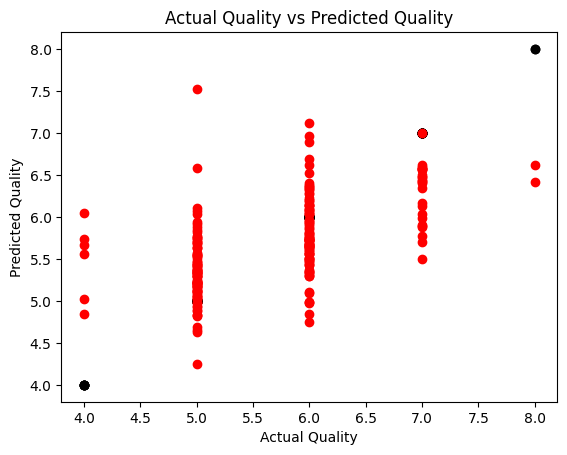
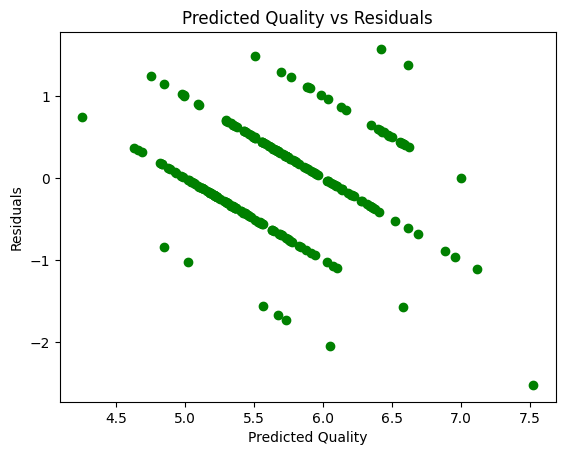

```python
# Import necessary libraries
import pandas as pd
import numpy as np
import matplotlib.pyplot as plt
from sklearn.model_selection import train_test_split
from sklearn.linear_model import LinearRegression
from sklearn.metrics import mean_squared_error, r2_score
```


```python
# Load the Wine Quality dataset (you can download it from various sources)
wine_data = pd.read_csv("WineQT.csv")
```


```python
# Print the first 5 rows of the dataframe.
wine_data.head()
```


<div>
<style scoped>
    .dataframe tbody tr th:only-of-type {
        vertical-align: middle;
    }

    .dataframe tbody tr th {
        vertical-align: top;
    }

    .dataframe thead th {
        text-align: right;
    }
</style>
<table border="1" class="dataframe">
  <thead>
    <tr style="text-align: right;">
      <th></th>
      <th>fixed acidity</th>
      <th>volatile acidity</th>
      <th>citric acid</th>
      <th>residual sugar</th>
      <th>chlorides</th>
      <th>free sulfur dioxide</th>
      <th>total sulfur dioxide</th>
      <th>density</th>
      <th>pH</th>
      <th>sulphates</th>
      <th>alcohol</th>
      <th>quality</th>
      <th>Id</th>
    </tr>
  </thead>
  <tbody>
    <tr>
      <th>0</th>
      <td>7.4</td>
      <td>0.70</td>
      <td>0.00</td>
      <td>1.9</td>
      <td>0.076</td>
      <td>11.0</td>
      <td>34.0</td>
      <td>0.9978</td>
      <td>3.51</td>
      <td>0.56</td>
      <td>9.4</td>
      <td>5</td>
      <td>0</td>
    </tr>
    <tr>
      <th>1</th>
      <td>7.8</td>
      <td>0.88</td>
      <td>0.00</td>
      <td>2.6</td>
      <td>0.098</td>
      <td>25.0</td>
      <td>67.0</td>
      <td>0.9968</td>
      <td>3.20</td>
      <td>0.68</td>
      <td>9.8</td>
      <td>5</td>
      <td>1</td>
    </tr>
    <tr>
      <th>2</th>
      <td>7.8</td>
      <td>0.76</td>
      <td>0.04</td>
      <td>2.3</td>
      <td>0.092</td>
      <td>15.0</td>
      <td>54.0</td>
      <td>0.9970</td>
      <td>3.26</td>
      <td>0.65</td>
      <td>9.8</td>
      <td>5</td>
      <td>2</td>
    </tr>
    <tr>
      <th>3</th>
      <td>11.2</td>
      <td>0.28</td>
      <td>0.56</td>
      <td>1.9</td>
      <td>0.075</td>
      <td>17.0</td>
      <td>60.0</td>
      <td>0.9980</td>
      <td>3.16</td>
      <td>0.58</td>
      <td>9.8</td>
      <td>6</td>
      <td>3</td>
    </tr>
    <tr>
      <th>4</th>
      <td>7.4</td>
      <td>0.70</td>
      <td>0.00</td>
      <td>1.9</td>
      <td>0.076</td>
      <td>11.0</td>
      <td>34.0</td>
      <td>0.9978</td>
      <td>3.51</td>
      <td>0.56</td>
      <td>9.4</td>
      <td>5</td>
      <td>4</td>
    </tr>
  </tbody>
</table>
</div>


```python
# Shape of the dataset
wine_data.shape
```


    (1143, 13)


```python
# Select the features (independent variables) and target variable (dependent variable)
X = wine_data.drop("quality", axis=1)
y = wine_data["quality"]
```


```python
# Split the dataset into a training set and a testing set
X_train, X_test, y_train, y_test = train_test_split(X, y, test_size=0.2, random_state=42)
```

### Model Selection and Evaluation


```python
model = LinearRegression()
```


```python
model.fit(X_train, y_train)
```


<style>#sk-container-id-1 {color: black;}#sk-container-id-1 pre{padding: 0;}#sk-container-id-1 div.sk-toggleable {background-color: white;}#sk-container-id-1 label.sk-toggleable__label {cursor: pointer;display: block;width: 100%;margin-bottom: 0;padding: 0.3em;box-sizing: border-box;text-align: center;}#sk-container-id-1 label.sk-toggleable__label-arrow:before {content: "▸";float: left;margin-right: 0.25em;color: #696969;}#sk-container-id-1 label.sk-toggleable__label-arrow:hover:before {color: black;}#sk-container-id-1 div.sk-estimator:hover label.sk-toggleable__label-arrow:before {color: black;}#sk-container-id-1 div.sk-toggleable__content {max-height: 0;max-width: 0;overflow: hidden;text-align: left;background-color: #f0f8ff;}#sk-container-id-1 div.sk-toggleable__content pre {margin: 0.2em;color: black;border-radius: 0.25em;background-color: #f0f8ff;}#sk-container-id-1 input.sk-toggleable__control:checked~div.sk-toggleable__content {max-height: 200px;max-width: 100%;overflow: auto;}#sk-container-id-1 input.sk-toggleable__control:checked~label.sk-toggleable__label-arrow:before {content: "▾";}#sk-container-id-1 div.sk-estimator input.sk-toggleable__control:checked~label.sk-toggleable__label {background-color: #d4ebff;}#sk-container-id-1 div.sk-label input.sk-toggleable__control:checked~label.sk-toggleable__label {background-color: #d4ebff;}#sk-container-id-1 input.sk-hidden--visually {border: 0;clip: rect(1px 1px 1px 1px);clip: rect(1px, 1px, 1px, 1px);height: 1px;margin: -1px;overflow: hidden;padding: 0;position: absolute;width: 1px;}#sk-container-id-1 div.sk-estimator {font-family: monospace;background-color: #f0f8ff;border: 1px dotted black;border-radius: 0.25em;box-sizing: border-box;margin-bottom: 0.5em;}#sk-container-id-1 div.sk-estimator:hover {background-color: #d4ebff;}#sk-container-id-1 div.sk-parallel-item::after {content: "";width: 100%;border-bottom: 1px solid gray;flex-grow: 1;}#sk-container-id-1 div.sk-label:hover label.sk-toggleable__label {background-color: #d4ebff;}#sk-container-id-1 div.sk-serial::before {content: "";position: absolute;border-left: 1px solid gray;box-sizing: border-box;top: 0;bottom: 0;left: 50%;z-index: 0;}#sk-container-id-1 div.sk-serial {display: flex;flex-direction: column;align-items: center;background-color: white;padding-right: 0.2em;padding-left: 0.2em;position: relative;}#sk-container-id-1 div.sk-item {position: relative;z-index: 1;}#sk-container-id-1 div.sk-parallel {display: flex;align-items: stretch;justify-content: center;background-color: white;position: relative;}#sk-container-id-1 div.sk-item::before, #sk-container-id-1 div.sk-parallel-item::before {content: "";position: absolute;border-left: 1px solid gray;box-sizing: border-box;top: 0;bottom: 0;left: 50%;z-index: -1;}#sk-container-id-1 div.sk-parallel-item {display: flex;flex-direction: column;z-index: 1;position: relative;background-color: white;}#sk-container-id-1 div.sk-parallel-item:first-child::after {align-self: flex-end;width: 50%;}#sk-container-id-1 div.sk-parallel-item:last-child::after {align-self: flex-start;width: 50%;}#sk-container-id-1 div.sk-parallel-item:only-child::after {width: 0;}#sk-container-id-1 div.sk-dashed-wrapped {border: 1px dashed gray;margin: 0 0.4em 0.5em 0.4em;box-sizing: border-box;padding-bottom: 0.4em;background-color: white;}#sk-container-id-1 div.sk-label label {font-family: monospace;font-weight: bold;display: inline-block;line-height: 1.2em;}#sk-container-id-1 div.sk-label-container {text-align: center;}#sk-container-id-1 div.sk-container {/* jupyter's `normalize.less` sets `[hidden] { display: none; }` but bootstrap.min.css set `[hidden] { display: none !important; }` so we also need the `!important` here to be able to override the default hidden behavior on the sphinx rendered scikit-learn.org. See: https://github.com/scikit-learn/scikit-learn/issues/21755 */display: inline-block !important;position: relative;}#sk-container-id-1 div.sk-text-repr-fallback {display: none;}</style><div id="sk-container-id-1" class="sk-top-container"><div class="sk-text-repr-fallback"><pre>LinearRegression()</pre><b>In a Jupyter environment, please rerun this cell to show the HTML representation or trust the notebook. <br />On GitHub, the HTML representation is unable to render, please try loading this page with nbviewer.org.</b></div><div class="sk-container" hidden><div class="sk-item"><div class="sk-estimator sk-toggleable"><input class="sk-toggleable__control sk-hidden--visually" id="sk-estimator-id-1" type="checkbox" checked><label for="sk-estimator-id-1" class="sk-toggleable__label sk-toggleable__label-arrow">LinearRegression</label><div class="sk-toggleable__content"><pre>LinearRegression()</pre></div></div></div></div></div>


```python
# Print the intercept
print("Intercept:", model.intercept_)
# Print the coefficients
print("Coefficients:", model.coef_)
# Print the R-squared value for the model
print("R-Squared:", model.score(X_train, y_train))
```

    Intercept: 36.49622742034098
    Coefficients: [ 4.48281781e-02 -1.32650965e+00 -3.20227391e-01  4.64672501e-03
     -1.83692523e+00  2.78901313e-03 -2.58694082e-03 -3.27678330e+01
     -2.84072230e-01  9.53929276e-01  2.71613626e-01 -7.20729446e-05]
    R-Squared: 0.38350132469569986


```python
# Predict the values of the testing set
y_pred = model.predict(X_test)
```


```python
# Print the predicted values
print("Predicted values:", y_pred)
# Print the actual values
print("Actual values:", y_test.values)
```

    Predicted values: [5.42239406 4.75039315 5.29684786 5.08885868 6.09486333 6.61357779
     5.4017609  5.12073623 5.80682335 5.32701664 6.34740954 6.36404342
     5.30874791 6.20726473 5.82424736 4.84564054 5.6866377  5.69867218
     5.46145685 6.40788444 6.03767614 6.03147727 5.20921387 6.48042456
     5.62504152 5.15767898 6.56630591 5.96162446 5.13243268 5.55393556
     6.22138034 5.50621416 6.61300256 5.72900211 5.57167536 5.30091294
     5.50270472 6.03438174 6.9574108  6.57721823 6.44071484 5.36204407
     7.11515613 5.3357927  5.02045693 5.1019234  5.66565116 5.86060262
     4.62611376 5.64639624 6.43111192 5.3070245  5.66220358 5.90248884
     5.7764028  6.40204632 5.49239433 5.66938259 6.05514973 5.22988268
     5.53032108 5.94808156 5.64622439 6.32047068 6.13819951 5.42307061
     6.88637688 5.23198061 4.89240584 5.94146638 5.72706586 5.36371717
     5.87330383 5.930108   5.20816681 5.18102988 5.84084001 5.87519663
     5.56537843 5.44033853 5.40608755 5.55643832 6.10128776 5.29822848
     5.49734983 6.03451096 5.34687089 5.6974897  5.72681184 5.29496201
     4.68397464 5.55695274 4.97804761 5.17647692 5.01828612 5.16874364
     5.33114803 6.62399797 5.93894188 5.60837069 5.69732096 6.37610023
     5.22035641 6.13830344 5.25352322 5.34490929 5.89277194 6.16666685
     5.58668514 6.56645076 5.98169489 5.29184041 5.4800231  6.0294004
     4.99093382 5.061652   5.33473638 6.42138353 5.7626642  4.82928225
     5.20620271 4.96992829 5.63039297 6.68734369 5.12155877 5.7081158
     5.74711888 5.73377378 4.98836899 6.34104493 5.09344585 4.92429433
     5.88902841 5.72761173 7.5251219  4.65411865 4.25272645 5.55340939
     5.54525202 5.73382194 6.99983494 5.34624769 5.6573963  4.87519337
     6.40987969 5.18446797 5.04901513 5.43076086 4.81623232 4.9340132
     6.58731777 5.42349931 6.33687426 5.33430743 5.91097736 5.67419869
     5.43068878 5.76187551 6.13328002 5.68231322 5.91201742 4.98545116
     5.7301566  5.6295802  5.76982625 5.350188   6.09995296 6.04911622
     5.60937534 5.2085794  6.52465666 5.36957031 5.43705669 5.63973057
     5.36744872 5.1815714  6.47092085 6.07255401 5.65482782 5.371954
     6.07147777 5.75435623 5.63932537 5.36143138 5.214711   5.56330047
     6.27852249 4.83213573 6.35160548 5.73281137 5.7290187  5.80131083
     6.55905346 5.82571986 5.54739967 5.46248875 5.04360668 6.57158693
     6.59359174 6.28008716 5.68938741 5.77881181 5.27959543 5.53932248
     5.88377579 5.50233434 5.217547   5.22908917 6.18210143 6.20384406
     5.1234562  6.12960094 5.50725131 5.67769048 5.50584127 5.10162049
     6.49869588 5.06768797 6.08294074 5.79419084 5.67068135 5.45333428
     5.0281772  5.74321052 4.8459337  6.13966888 5.36275274 5.47705627
     5.7460512 ]
    Actual values: [5 6 5 6 6 8 5 5 6 5 7 6 6 6 5 6 5 5 5 6 6 6 5 7 6 5 7 6 5 6 6 6 6 5 6 5 6
     7 6 5 7 5 6 5 4 5 6 6 5 6 7 5 6 7 5 7 6 4 6 5 5 6 5 6 6 6 6 5 5 5 6 5 6 6
     5 5 5 5 5 6 5 6 5 6 6 6 6 5 6 6 5 5 6 5 5 5 6 7 6 6 7 6 5 6 5 5 6 7 6 7 7
     5 5 5 6 5 5 8 6 5 5 5 5 6 5 6 6 6 6 6 5 5 7 6 5 5 5 6 5 6 7 6 6 5 7 5 5 5
     5 5 7 6 6 5 6 6 5 5 7 5 5 5 6 5 7 5 6 4 6 5 6 5 5 6 5 5 7 5 6 6 6 5 6 6 5
     4 6 5 6 4 6 6 7 6 5 6 5 7 7 6 6 6 5 5 7 7 5 5 6 6 5 6 6 6 5 6 7 5 6 6 6 5
     5 5 4 6 5 6 6]


```python
# Evaluate the model using Mean Squared Error
print("Mean Squared Error:", mean_squared_error(y_test, y_pred))
# Evaluate the model using R-squared value
print("R-Squared:", r2_score(y_test, y_pred))
```

    Mean Squared Error: 0.3824283521291851
    R-Squared: 0.31276385395084005


```python
# Plot the actual values
plt.scatter(y_test, y_test, color="black")
# Plot the predicted values
plt.scatter(y_test, y_pred, color="red")
plt.xlabel("Actual Quality")
plt.ylabel("Predicted Quality")
plt.title("Actual Quality vs Predicted Quality")
plt.show()
```


    

    


```python
# Plot the residuals
plt.scatter(y_pred, y_test - y_pred, color="green")
plt.xlabel("Predicted Quality")
plt.ylabel("Residuals")
plt.title("Predicted Quality vs Residuals")
plt.show()
```


    

    


```python
# Accuracy of the model
print("Accuracy of the model:", model.score(X_test, y_test))
```

    Accuracy of the model: 0.31276385395084005


```python
from sklearn.metrics import accuracy_score, classification_report

# Convert the predicted values to integers
y_pred = y_pred.astype(int)

# Print the classification report
print(classification_report(y_test, y_pred))

# Print the accuracy of the model
print("Accuracy of the model:", accuracy_score(y_test, y_pred))
```

                  precision    recall  f1-score   support
    
               4       0.05      0.17      0.08         6
               5       0.51      0.81      0.63        96
               6       0.54      0.30      0.39        99
               7       0.00      0.00      0.00        26
               8       0.00      0.00      0.00         2
    
        accuracy                           0.48       229
       macro avg       0.22      0.26      0.22       229
    weighted avg       0.45      0.48      0.43       229
    
    Accuracy of the model: 0.4759825327510917


    C:\Users\anish\AppData\Local\Packages\PythonSoftwareFoundation.Python.3.11_qbz5n2kfra8p0\LocalCache\local-packages\Python311\site-packages\sklearn\metrics\_classification.py:1469: UndefinedMetricWarning: Precision and F-score are ill-defined and being set to 0.0 in labels with no predicted samples. Use `zero_division` parameter to control this behavior.
      _warn_prf(average, modifier, msg_start, len(result))
    C:\Users\anish\AppData\Local\Packages\PythonSoftwareFoundation.Python.3.11_qbz5n2kfra8p0\LocalCache\local-packages\Python311\site-packages\sklearn\metrics\_classification.py:1469: UndefinedMetricWarning: Precision and F-score are ill-defined and being set to 0.0 in labels with no predicted samples. Use `zero_division` parameter to control this behavior.
      _warn_prf(average, modifier, msg_start, len(result))
    C:\Users\anish\AppData\Local\Packages\PythonSoftwareFoundation.Python.3.11_qbz5n2kfra8p0\LocalCache\local-packages\Python311\site-packages\sklearn\metrics\_classification.py:1469: UndefinedMetricWarning: Precision and F-score are ill-defined and being set to 0.0 in labels with no predicted samples. Use `zero_division` parameter to control this behavior.
      _warn_prf(average, modifier, msg_start, len(result))

