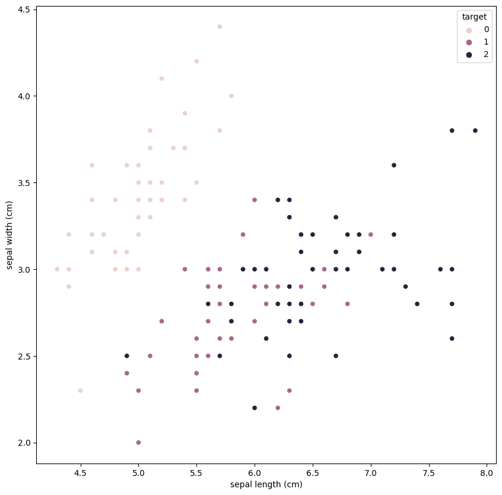
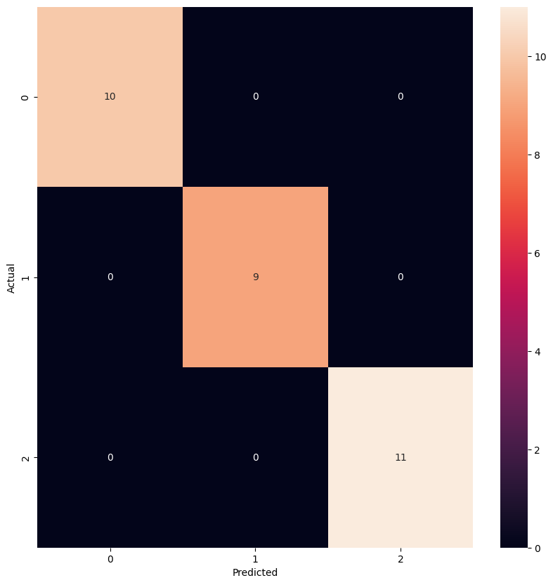

```python
from sklearn.datasets import load_iris

iris = load_iris()
```


```python
import pandas as pd

data = pd.DataFrame(iris.data, columns=iris.feature_names)
target = pd.DataFrame(iris.target, columns=['target'])

# Merge data and target into a single DataFrame
iris_df = pd.concat([data, target], axis=1)

# Display the first few rows of the dataset
print(iris_df.head())
```

       sepal length (cm)  sepal width (cm)  petal length (cm)  petal width (cm)  \
    0                5.1               3.5                1.4               0.2   
    1                4.9               3.0                1.4               0.2   
    2                4.7               3.2                1.3               0.2   
    3                4.6               3.1                1.5               0.2   
    4                5.0               3.6                1.4               0.2   
    
       target  
    0       0  
    1       0  
    2       0  
    3       0  
    4       0  


```python
# Plot a scatter plot of the data points to visualize the distribution of the data
import matplotlib.pyplot as plt
import seaborn as sns

plt.figure(figsize=(10, 10))
sns.scatterplot(x='sepal length (cm)', y='sepal width (cm)', hue='target', data=iris_df)
plt.show()
```


    

    


```python
# Shape of the dataset
print(iris_df.shape)
```

    (150, 5)


```python
from sklearn.model_selection import train_test_split

X_train, X_test, y_train, y_test = train_test_split(data, target, test_size=0.2, random_state=42)
```

### Train and evaluate each model on the test set


```python
from sklearn.metrics import accuracy_score, classification_report
from sklearn.linear_model import LogisticRegression

lr_model = LogisticRegression()
lr_model.fit(X_train, y_train)
lr_predictions = lr_model.predict(X_test)

# Evaluate the model
accuracy = accuracy_score(y_test, lr_predictions)
report = classification_report(y_test, lr_predictions)
print(f"Accuracy: {accuracy}")
print(report)
```

    Accuracy: 1.0
                  precision    recall  f1-score   support
    
               0       1.00      1.00      1.00        10
               1       1.00      1.00      1.00         9
               2       1.00      1.00      1.00        11
    
        accuracy                           1.00        30
       macro avg       1.00      1.00      1.00        30
    weighted avg       1.00      1.00      1.00        30
    


    C:\Users\anish\AppData\Local\Packages\PythonSoftwareFoundation.Python.3.11_qbz5n2kfra8p0\LocalCache\local-packages\Python311\site-packages\sklearn\utils\validation.py:1184: DataConversionWarning: A column-vector y was passed when a 1d array was expected. Please change the shape of y to (n_samples, ), for example using ravel().
      y = column_or_1d(y, warn=True)
    C:\Users\anish\AppData\Local\Packages\PythonSoftwareFoundation.Python.3.11_qbz5n2kfra8p0\LocalCache\local-packages\Python311\site-packages\sklearn\linear_model\_logistic.py:460: ConvergenceWarning: lbfgs failed to converge (status=1):
    STOP: TOTAL NO. of ITERATIONS REACHED LIMIT.
    
    Increase the number of iterations (max_iter) or scale the data as shown in:
        https://scikit-learn.org/stable/modules/preprocessing.html
    Please also refer to the documentation for alternative solver options:
        https://scikit-learn.org/stable/modules/linear_model.html#logistic-regression
      n_iter_i = _check_optimize_result(


```python
# Plot the confusion matrix
from sklearn.metrics import confusion_matrix

cm = confusion_matrix(y_test, lr_predictions)
plt.figure(figsize=(10, 10))
sns.heatmap(cm, annot=True, fmt='d')
plt.xlabel('Predicted')
plt.ylabel('Actual')
plt.show()
```


    

    

